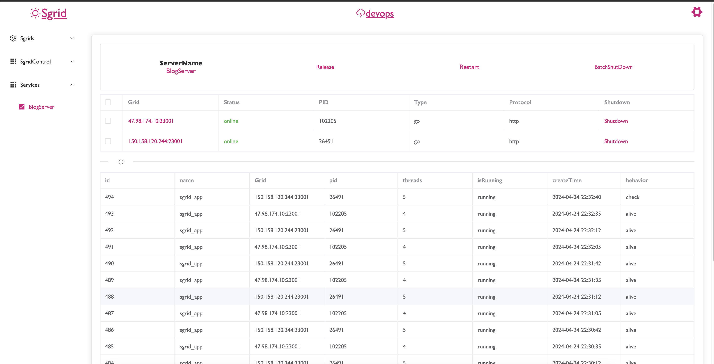
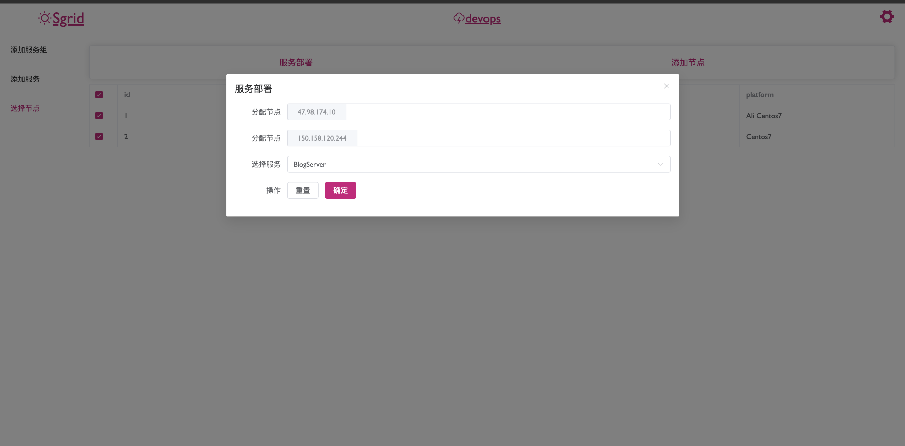
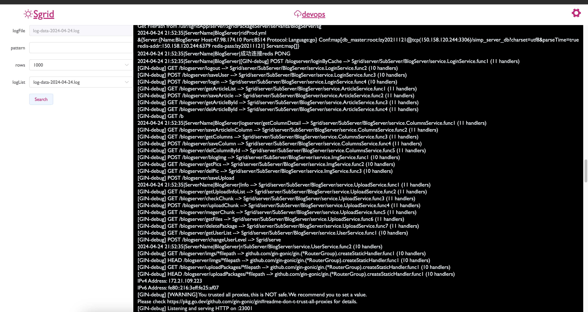

<h2 align="center">Sgrid</h2>

<h3 align="center">敏捷集群管理服务</h3>

***
<h4 align="center">主页</h4>


<h4 align="center">部署界面</h4>


<h4 align="center">日志界面</h4>


***
Compile

````shell
#  ***************** proto ***************
protoc --go_out=. --go-grpc_out=. SgridPackage.proto

protoc --go_out=. SgridPackage.proto

#  ***************** proto ***************

#  ***************** client ***************
cd client 

npm i

./build.sh

cd ..
#  ***************** client ***************

#  ***************** server ***************
./prod.sh
#  ***************** server ***************
````

***
Sgrid应用程序支持：

1. 多节点组管理

2. 使用GRPC构建后端服务和Protobuf进行通信

3. 多语言支持（Node、Java、Go）

4. 支持横向和纵向扩展，快速启停服务

5. 动态配置文件

6. 连续心跳检测

7. 版本控制、文档

8. 多节点日志监控

9. 一个进程中可以同时启动多个服务，并且可以监听多个地址。